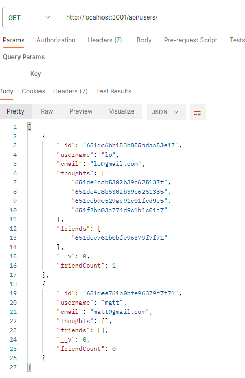

# Social Network API

## Description

This is a API for a social network application that allows users to share thoughts, react to thoughts, and create a friend list. This application uses the NoSQL database MongoDB with Mongoose to develop a schema for the data.
 
This application was created with the following criteria:

- When enter node server.js the server is started and Mongoose models are synced to the MongoDB database
- Get routes created: get all users and thoughts; get single user or thought
- Post routes created: create a new user, friend, thought, or reaction
- Update routes created: update user infomation or a thought
- Delete routes created: delete a user, thought, friend, or reaction

## Table of Contents

- [Installation](#installation)
- [Usage](#usage)
- [License](#license)
- [Contributing](#contributing)

## Installation

- In order to use the application node.js will need to be installed.  
  Node.js Installation: https://nodejs.org/en/download

Node Dependencies:

- Express: Used to create routes for the application
- Mongoose: Object Data Modeling (ODM) library for MongoDB
- Moment: Date formatting

## Usage

To run the application locally use npm install to install all node packages. Then run node server.js in the command line.  
All routes can be tested in API platform like Insomnia or Postman.
 
Testing Get all users route in Postman:
 

## License

MIT License

## Contributing

The following websites were used for reference to create this application: 
Mongoose Virtuals: https://www.youtube.com/watch?v=TZPygUt6H00 
https://mongoosejs.com/docs/tutorials/getters-setters.html 
https://www.youtube.com/watch?v=YDLjahSfZ10

## Walkthrough Video

[Video Demonstration](https://drive.google.com/file/d/1fizxE_igKnDTE1ungzFxdtFupx13BYGw/view)
